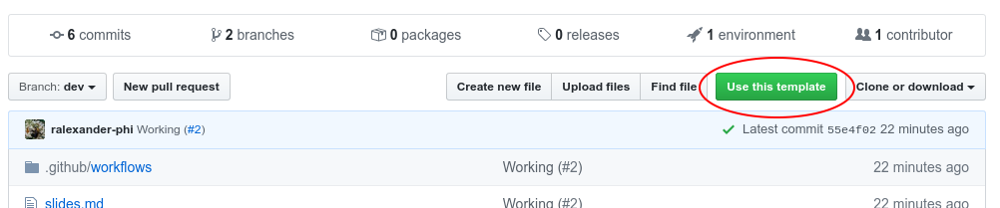
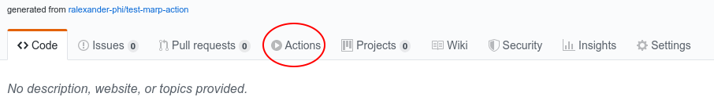

<!--
theme: gaia
class:
 - invert
headingDivider: 2
paginate: true
-->

<!--
_class:
 - lead
 - invert
-->

# Introducing Reference Data Types and Dynamic Object Allocation

Using visual debuggers to avoid common object misconceptions

## Common object misconceptions

## Review: Java Data Types

- Primitive data types are predefined in Java.
- Reference data types can be defined by the programmer.

| Java Data Types      |                                                      |                                     |
| -------------------- | ---------------------------------------------------- | ----------------------------------- |
| Primitive Data Types | byte, short, int, long, float, double, boolean, char | Variable stores a primitive value   |
| Reference Data Types | String, ArrayList, Scanner, ...                      | Variable stores an object reference |

## Reference Data Types

Java has several types of **reference data types**.

## Review: What is an object?

TODO: real world objects vs software objects. .....
https://docs.oracle.com/javase/tutorial/java/concepts/object.html

All objects have **state** and **behavior**.

- State encapsulates the relevant properties (data) about an object.
- Behavior is the set of operations that access and modify the object state.

| Object       | State                                   | Behavior                                        |
| ------------ | --------------------------------------- | ----------------------------------------------- |
| Dog          | name <br> breed <br> is wagging tail    | eat treat <br> fetch toy <br> bark              |
| Mobile Phone | brand <br> model <br> is on <br> volume | toggle on/off <br> adjust volume <br> send text |
| Appointment  | date <br> time <br> participants        | schedule <br> cancel                            |

## What is a class?

Template for describing similar objects.

define state (fields) and behavior (methods).

## Dog Visualization

<iframe width="800" height="500" frameborder="0" src="https://pythontutor.com/iframe-embed.html#code=public%20class%20Fish%20%7B%0A%0A%20%20%20%20//Field%20declarations%0A%20%20%20%20String%20species%3B%0A%20%20%20%20int%20age%3B%0A%0A%20%20%20%20public%20static%20void%20main%28String%5B%5D%20args%29%20%7B%0A%0A%20%20%20%20%20%20%20%20//%20Declare,%20instantiate,%20and%20initialize%202%20Fish%20objects%0A%20%20%20%20%20%20%20%20//%20Each%20variable%20stores%20an%20object%20reference%0A%20%20%20%20%20%20%20%20Fish%20bubbles%20%3D%20new%20Fish%28%29%3B%0A%20%20%20%20%20%20%20%20Fish%20jaws%20%3D%20new%20Fish%28%29%3B%0A%0A%20%20%20%20%20%20%20%20//Print%20default%20string%20representation%0A%20%20%20%20%20%20%20%20System.out.println%28bubbles%29%3B%0A%20%20%20%20%20%20%20%20System.out.println%28jaws%29%3B%0A%0A%20%20%20%20%20%20%20%20//Print%20initial%20field%20values%0A%20%20%20%20%20%20%20%20//Use%20dot%20notation%20objectReference.fieldName%20to%20access%20an%20object%20field%0A%20%20%20%20%20%20%20%20System.out.println%28%22Initial%20default%20state%3A%22%29%3B%0A%20%20%20%20%20%20%20%20System.out.printf%28%22bubbles%3A%20%25s%20%25d%25n%22,%20bubbles.species,%20bubbles.age%29%3B%0A%20%20%20%20%20%20%20%20System.out.printf%28%22jaws%3A%20%25s%20%25d%25n%22,%20jaws.species,%20jaws.age%29%3B%0A%0A%20%20%20%20%20%20%20%20//Assign%20new%20values%20to%20the%20object%20fields%0A%20%20%20%20%20%20%20%20bubbles.species%20%3D%20%22Goldfish%22%3B%0A%20%20%20%20%20%20%20%20bubbles.age%20%3D%2015%3B%0A%20%20%20%20%20%20%20%20jaws.species%3D%20%22Red%20Tail%20Shark%22%3B%0A%20%20%20%20%20%20%20%20jaws.age%20%3D%208%3B%0A%0A%20%20%20%20%20%20%20%20//Print%20updated%20field%20values%0A%20%20%20%20%20%20%20%20System.out.println%28%22Updated%20state%3A%22%29%3B%0A%20%20%20%20%20%20%20%20System.out.printf%28%22bubbles%3A%20%25s%20%25d%25n%22,%20bubbles.species,%20bubbles.age%29%3B%0A%20%20%20%20%20%20%20%20System.out.printf%28%22jaws%3A%20%25s%20%25d%25n%22,%20jaws.species,%20jaws.age%29%3B%0A%20%20%20%20%7D%0A%0A%7D&codeDivHeight=400&codeDivWidth=350&cumulative=false&curInstr=0&heapPrimitives=true&origin=opt-frontend.js&py=java&rawInputLstJSON=%5B%5D&textReferences=false"> </iframe>

## Setup

Want to create your own?

First, create a new repo
[from the template repo](https://github.com/ralexander-phi/marp-to-pages).



## Configure GitHub Pages

Open your new repo and
[setup publishing](https://help.github.com/en/github/working-with-github-pages/configuring-a-publishing-source-for-your-github-pages-site#choosing-a-publishing-source).

You'll typically use `gh-pages` as the deploy branch.

## Review Build

Click on Actions tab and see if the build succeeded (it may take some time).



You should now see the generated files in the `gh-pages` branch.

## View webpage

Open your deployed webpage to see the content.

Out of the box you should see `README.md` as `/index.html` and `/README.pdf`.
Slides under `docs/` are also converted.

## Running locally

Locally you'll run commands like:

```
$ marp README.md -o build/README.pdf
```

or

```
$ npx @marp-team/marp-cli@latest README.md -o build/README.pdf
```

## As a workflow step

The workflow runs an equivalent step:

```
- name: Marp Build (README.pdf)
  uses: docker://marpteam/marp-cli:v1.7.0
  with:
    args: README.md -o build/README.pdf
  env:
    MARP_USER: root:root
```

Note the `args` match the previous slide.

## Customizing the build

Anything in the `build/` folder will be deployed to GitHub Pages.

You can copy extra files or run further processing steps using other tools.

## Learn more about Marp

This is a good time to learn more about Marp. Here's some resources:

- [CommonMark](https://commonmark.org/)
- [Cheat Sheet](https://commonmark.org/help/)
- [Themes](https://github.com/marp-team/marp-core/tree/master/themes)
- [CSS Themes](https://marpit.marp.app/theme-css)
- [Directives](https://marpit.marp.app/directives)
- [VS Code plugin](https://marketplace.visualstudio.com/items?itemName=marp-team.marp-vscode)

## Example Sites

Known sites using this action are:

- [University of Illinois at Urbana-Champaign's CS 199 Even More Practice](https://cs199emp.netlify.app/)
  [(code)](https://github.com/harsh183/emp-125)
- [Exploring agent based models](https://roiarthurb.github.io/Talk-UMMISCO_06-07-2020/)
  [(code)](https://github.com/RoiArthurB/Talk-UMMISCO_06-07-2020)

Send a [pull request](https://github.com/ralexander-phi/marp-to-pages) to get
your site added.

## Publish your slides

When you are ready to share your presentation, commit or merge to `main` and
your content on GitHub Pages will automatically update.

# 🎉

<!--
_class:
 - lead
 - invert
-->

### Hooray!
