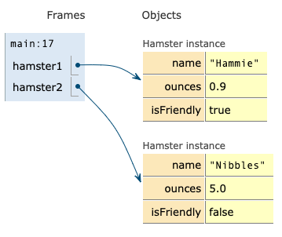
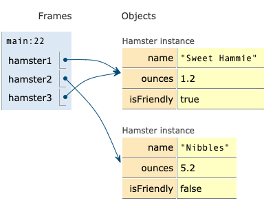

## Some background before I start the lesson...

- Initial lessons use existing classes (String, Arraylist, Random, Swing)
  - Practice reading APIs
  - Practice instantiating objects
  - Practice invoking methods
  - Using Visual/IDE debugger to introduce concepts of objects, state,
    references
- Today's Lesson: Defining a new Java class
  - Initial emphasize on object state and object references
  - Visual debugger to clarify object concepts<br> (map static syntax to dynamic
    runtime model)
  - Introduce constructors/methods **after** introducing object references

---

## Today's Lesson - Defining a new Java class

- We've seen how to use existing Java classes (String, ArrayList, Random, etc.)
  to solve a few interesting problems
- Today we'll learn how to define **new** classes to model the state and
  behavior of some real world objects

---

## Review: Java is an Object-Oriented Language

| Object                      | State <br>(properties)            | Behavior <br> (access & modify state)                |
| --------------------------- | --------------------------------- | ---------------------------------------------------- |
| Mobile Phone                | model <br> is on <br> volume, ... | toggle on/off <br> adjust volume <br> send text, ... |
| Random Number<br> Generator | seed, multiplier,...              | generate random integer,<br>random boolean, ...      |
| List                        | list elements                     | add element<br>delete element<br>get size, ...       |

---

## Defining a new Java class

A **Class** is a blueprint for describing similar objects

- fields (instance variables) describe object state
- methods implement object behavior (access and update state)

```java
public class ClassName {

  //Field declarations

  //Method declarations

}
```

---

## Defining a new Java class


```java
public class Fish {

    //Field declarations
    int age;
    boolean isAggressive;
    String species;

}
```

An object is an **instance** of a class

---

## Creating a new `Fish` instance

```java
public class Fish {
    int age;
    boolean isAggressive;
    String species;
}
```

| Java Expression | Memory<br> (Heap)   |                                                                                                                                           |
| --------------- | ------------------- | ----------------------------------------------------------------------------------------------------------------------------------------- |
| `new Fish()`    |  | 1. Memory is allocated to store fields<br>2. Fields are initialize with default<br> values based on data type<br>3. Reference is returned |

---

## Quick Review: Variable declarations must specify data type

| Java Data Types                     | Examples                                             | Variable                                                |
| ----------------------------------- | ---------------------------------------------------- | ------------------------------------------------------- |
| Primitive Types                     | byte, short, int, long, float, double, boolean, char | Store primitive value<br>(7, 3.5, true, 'a')            |
| Reference Types<br> (non-primitive) | String, ArrayList, Random, Fish, ...                 | Store object reference<br> (info about memory location) |

A class is one kind of reference type (there are others as well)

---

## Reference Variable

- Declared with a reference data type (such as class **Fish**).
- Stores an object reference or `null`.

```java
Fish goldie = new Fish();
Fish jaws = new Fish();
```


---

## Updating object state


- Each fish instance has it's own variable named **age**.
- **Dot notation** is used to access a field through a reference.
  `objectReference.fieldName`

```java
goldie.age = 15;
goldie.species = "Goldfish";

jaws.age = 8;
jaws.species= "Red Tail Shark";
jaws.isAggressive = true;
```

[pythontutor.com visualization](https://pythontutor.com/render.html#code=public%20class%20Fish%20%7B%0A%0A%20%20%20%20//Field%20declarations%0A%20%20%20%20int%20age%3B%0A%20%20%20%20boolean%20isAggressive%3B%0A%20%20%20%20String%20species%3B%0A%0A%20%20%20%20public%20static%20void%20main%28String%5B%5D%20args%29%20%7B%0A%0A%20%20%20%20%20%20%20%20//%20Instantiate%202%20Fish%20objects%0A%20%20%20%20%20%20%20%20//%20Each%20variable%20stores%20an%20object%20reference%0A%20%20%20%20%20%20%20%20Fish%20goldie%20%3D%20new%20Fish%28%29%3B%0A%20%20%20%20%20%20%20%20Fish%20jaws%20%3D%20new%20Fish%28%29%3B%0A%0A%20%20%20%20%20%20%20%20//Update%20object%20state%20%28fields%29%0A%20%20%20%20%20%20%20%20goldie.age%20%3D%2015%3B%0A%20%20%20%20%20%20%20%20goldie.species%20%3D%20%22Goldfish%22%3B%0A%0A%20%20%20%20%20%20%20%20jaws.age%20%3D%208%3B%0A%20%20%20%20%20%20%20%20jaws.species%3D%20%22Red%20Tail%20Shark%22%3B%0A%20%20%20%20%20%20%20%20jaws.isAggressive%20%3D%20true%3B%0A%0A%20%20%20%20%20%20%20%20//Print%20object%20state%0A%20%20%20%20%20%20%20%20System.out.printf%28%22goldie%3A%20%25s%20%25d%20%25b%25n%22,%20goldie.species,%20goldie.age,%20goldie.isAggressive%29%3B%0A%20%20%20%20%20%20%20%20System.out.printf%28%22jaws%3A%20%25s%20%25d%20%25b%25n%22,%20jaws.species,%20jaws.age,%20jaws.isAggressive%29%3B%0A%20%20%20%20%7D%0A%7D&cumulative=false&curInstr=0&heapPrimitives=nevernest&mode=display&origin=opt-frontend.js&py=java&rawInputLstJSON=%5B%5D&textReferences=false)

---

## NOTE : `String` is a reference data type

`species` actually stores an object reference

| String Literal<br> (default view) | String Reference    |
| --------------------------------- | ------------------- |
|                |  |

---

## Recall how an assignment statement works

1. evaluate expression on<br> right hand side
2. copy value into variable on <br>left hand side


---

## CHALLENGE

```java
public class Cat {

  String name;
  boolean isPurring;

  public static void main(String[] args) {
    Cat calico = new Cat();
    Cat tabby = new Cat();
    Cat favorite = calico;

    tabby.name = "Maru";
    calico.name= "Chestnut";
    favorite.isPurring = true;

    System.out.println(calico.name + "," + calico.isPurring);
    System.out.println(tabby.name + "," + tabby.isPurring);
    System.out.println(favorite.name + "," + favorite.isPurring);
  }
}
```


---

```java
Cat calico = new Cat();
Cat tabby = new Cat();
```

- `new Cat()` creates `Cat` instance with fields initialized to default values
- `calico` and `tabby` reference the new objects


---

## Multiple variables can reference the same object

```java
Cat calico = new Cat();
Cat tabby = new Cat();
Cat favorite = calico;
```

- Two primitive variables can store the same value.
- Two reference variables can store the same object reference.


---

## Updating object state

```java
Cat calico = new Cat();
Cat tabby = new Cat();
Cat favorite = calico;

tabby.name = "Maru";
calico.name= "Chestnut";
favorite.isPurring = true;
```


---

## What get's printed?

```java
System.out.println(calico.name + "," + calico.isPurring);
System.out.println(tabby.name + "," + tabby.isPurring);
System.out.println(favorite.name + "," + favorite.isPurring);
```


```text
Chestnut,true
Maru,false
Chestnut,true
```

---

## CHALLENGE

- Implement a class named `Hamster` with fields to store name, weight in ounces,
  and whether they are friendly.
- Implement a `main` method to instantiate two hamster and update their state as
  shown.



---

CHALLENGE:

- Edit the code to evolve the object state as shown in the diagram.
- Do not modify state using the variables `hamster1` or `hamster2`
- Use the variable `hamster3` to modify the `name` and `ounces`.



---

## Solution

```java
public class Hamster {

    String name;
    float ounces;
    boolean isFriendly;

    public static void main(String[] args) {
        Hamster hamster1 = new Hamster();
        Hamster hamster2 = new Hamster();

        hamster1.name = "Hammie";
        hamster1.ounces = 0.9f;
        hamster1.isFriendly = true;

        hamster2.name = "Nibbles";
        hamster2.ounces = Ωå5.2f;

        Hamster hamster3 = hamster1;
        hamster3.name = "Sweet Hammie";
        hamster3.ounces = 1.2f;

    }
}
```

---

## Methods - Implementing Object Behavior

---
