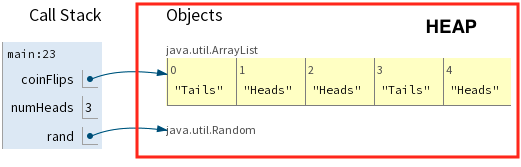

<!--
theme: default
auto-scaling: code
-->

## Some background before I start the lesson...

- Initial lessons use existing classes (String, Arraylist, Random)
  - practice reading APIs
  - practice instantiating objects
  - practice invoking static and instance methods
- Subsequent lesson on defining a new Java class
  - Delay introduction of constructors and methods
  - Initial emphasize on object state and object references
  - Visual debugger to clarify object concepts, avoid common misconceptions

---

## Today's Lesson - Defining a new Java class

We've seen how to use existing Java core and utility classes (String, ArrayList,
etc.) to solve some interesting problems.

Today we'll see how to define a **new** class to model some real world objects.

---

Objects have state (properties/attributes) and behavior (operations that
access/modify state)

| Object       | State                                   | Behavior                                        |
| ------------ | --------------------------------------- | ----------------------------------------------- |
| Mobile Phone | brand <br> model <br> is on <br> volume | toggle on/off <br> adjust volume <br> send text |
| Zoom meeting | date <br> time <br> link                | schedule <br> cancel<br>start<br>end            |
| ArrayList    | items in list                           | add item<br>delete item<br>get list size        |

---

- Primitive types are predefined in Java.
- Reference types can be defined by the programmer.

| Java Data Types                 |                                                      |                                     |
| ------------------------------- | ---------------------------------------------------- | ----------------------------------- |
| Primitive Types                 | byte, short, int, long, float, double, boolean, char | Variable stores a primitive value   |
| Reference Types (non-primitive) | String, ArrayList, Random, JButton, JFrame, ...      | Variable stores an object reference |

---

```java
ArrayList<String> coinFlips = new ArrayList<String>();
Random rand = new Random();
int numHeads = 0;
boolean heads = rand.nextBoolean();
while (numHeads < 3) {
    if (heads) {
        numHeads++;
        coinFlips.add("Heads");
    }
    else {
        coinFlips.add("Tails");
    }
    heads = rand.nextBoolean();
}
System.out.println("Total coin flips:" + coinFlips.size());
System.out.println(coinFlips);
```



- Local variables and parameters live on the **call stack**.
- Objects live in a part of dynamic memory called the **heap**.

---

## Defining a Java Class

- Template/blueprint for describing similar software objects.
- Define state (fields) and behavior (methods).

```java
public class ClassName {

  //Field declarations

  //Method declarations

}
```

## A class to model pet fish


```java
public class Fish {

    //Field declarations
    int age;
    boolean isAggressive;
    String species;

}
```

---

## Creating a new class instance (i.e. object)

```java
public class Fish {
    int age;
    boolean isAggressive;
    String species;
}
```

| Java Expression | Heap (dynamic memory) |
| --------------- | --------------------- |
| `new Fish()`    |    |

- Memory is allocated to store a value for each field
- Fields are initialize with default values based on data type: int 0, boolean
  false, String null
- Returns a reference to the new object

---

## Reference Variable

A **reference variable**:

- Is declared with a reference data type (such as class **Fish**).
- Stores an object reference or `null`.

```java
Fish goldie = new Fish();
Fish jaws = new Fish();
```


---

## Accessing an object's field

Suppose we'd like to update both fish as shown:


- Each fish instance has it's own variable named **age**.
- **Dot notation** is used to access a field through a reference.

`objectReference.fieldName`

```java
goldie.age = 15;
goldie.species = "Goldfish";

jaws.age = 8;
jaws.species= "Red Tail Shark";
jaws.isAggressive = true;
```

[pythontutor.com visualization](https://pythontutor.com/render.html#code=public%20class%20Fish%20%7B%0A%0A%20%20%20%20//Field%20declarations%0A%20%20%20%20int%20age%3B%0A%20%20%20%20boolean%20isAggressive%3B%0A%20%20%20%20String%20species%3B%0A%0A%20%20%20%20public%20static%20void%20main%28String%5B%5D%20args%29%20%7B%0A%0A%20%20%20%20%20%20%20%20//%20Instantiate%202%20Fish%20objects%0A%20%20%20%20%20%20%20%20//%20Each%20variable%20stores%20an%20object%20reference%0A%20%20%20%20%20%20%20%20Fish%20goldie%20%3D%20new%20Fish%28%29%3B%0A%20%20%20%20%20%20%20%20Fish%20jaws%20%3D%20new%20Fish%28%29%3B%0A%0A%20%20%20%20%20%20%20%20//Update%20object%20state%20%28fields%29%0A%20%20%20%20%20%20%20%20goldie.age%20%3D%2015%3B%0A%20%20%20%20%20%20%20%20goldie.species%20%3D%20%22Goldfish%22%3B%0A%0A%20%20%20%20%20%20%20%20jaws.age%20%3D%208%3B%0A%20%20%20%20%20%20%20%20jaws.species%3D%20%22Red%20Tail%20Shark%22%3B%0A%20%20%20%20%20%20%20%20jaws.isAggressive%20%3D%20true%3B%0A%0A%20%20%20%20%20%20%20%20//Print%20object%20state%0A%20%20%20%20%20%20%20%20System.out.printf%28%22goldie%3A%20%25s%20%25d%20%25b%25n%22,%20goldie.species,%20goldie.age,%20goldie.isAggressive%29%3B%0A%20%20%20%20%20%20%20%20System.out.printf%28%22jaws%3A%20%25s%20%25d%20%25b%25n%22,%20jaws.species,%20jaws.age,%20jaws.isAggressive%29%3B%0A%20%20%20%20%7D%0A%7D&cumulative=false&curInstr=0&heapPrimitives=nevernest&mode=display&origin=opt-frontend.js&py=java&rawInputLstJSON=%5B%5D&textReferences=false)

---

## NOTE : `String` is a reference data type

The species variable actually stores a reference to a separate **String**
object.

| String Literal<br> (default view) | String Reference    |
| --------------------------------- | ------------------- |
|                |  |

---

## Recall how an assignment statement works

The value of the expression on the right hand side is copied into the variable
on the left hand side.


---

## CHALLENGE

Consider the following code:

```java
public class Cat {

    String name;
    boolean isPurring;

    public static void main(String[] args) {
        Cat calico = new Cat();
        Cat tabby = new Cat();
        Cat favorite = calico;

        tabby.name = "Maru";
        calico.name= "Chestnut";
        favorite.isPurring = true;

        System.out.printf("calico: %s %b%n", calico.name, calico.isPurring);
        System.out.printf("tabby %s %b%n", tabby.name, tabby.isPurring);
        System.out.printf("favorite: %s %b%n", favorite.name, favorite.isPurring);
```

- Sketch out the heap and stack frame.
- What gets printed? Debug to confirm your answer.


---

## `new Cat()` creates an instance

<details>
<summary>

```java
Cat calico = new Cat();
Cat tabby = new Cat();
```

</summary>


</details>

---

## Multiple variables can reference the same object

<details>
<summary>

- Two primitive variables can store the same value.
- Two reference variables can reference the same object.

```java
Cat calico = new Cat();
Cat tabby = new Cat();
Cat favorite = calico
```

</summary>


</details>

---

## Updating object state

<details>
<summary>

```java
Cat calico = new Cat();
Cat tabby = new Cat();
Cat favorite = calico;

tabby.name = "Maru";
calico.name= "Chestnut";
favorite.isPurring = true;
```

</summary>


</details>

---

## What get's printed?

```java
System.out.printf("calico: %s %b%n", calico.name, calico.isPurring);
System.out.printf("tabby %s %b%n", tabby.name, tabby.isPurring);
System.out.printf("favorite: %s %b%n", favorite.name, favorite.isPurring);
```


```text
calico: Chestnut true
tabby: Maru false
favorite: Chestnut true
```

---

## CHALLENGE

- Implement a class named `Hamster` with fields to store a name, weight in
  ounces, and whether they are friendly.
- Implement a `main` method to instantiate two hamster and update their state as
  shown.
  - do not write unnecesary field assignments (consider default initialization).
- Step through with the debugger to confirm your code is correct.


